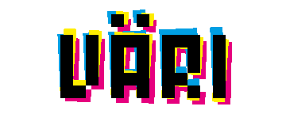

###VÄRI 
=====

*started at the global game bremen 2013*

Defend the heart from attackers of various dimensions and colors and fight them with their own weapons! To stand a chance against the little sacks filled with color, **you** have to use the power of the heart. Spread your structures by repeating fractions of all colors of the hearts wave's, preparing you against every color the sacks throw at you. Combine color waves for more powerful towers and see if you can even comprehend the might of the final boss: Mrs. blacKsacK. Enter the world of Cyan, Magenta, Yellow and sacK. If you dare...

---

*A collaboration of*

Felix Heibeck - (<a href="http://www.f3-h.de/">f3-h.de</a>) 
Julian Hespenheide - (<a href="http://www.julian-h.de/">julian-h.de</a>) 
Hendrik Heuer - (<a href="http://www.hen-drik.de/">hen-drik.de</a>) 
Michele Krüger - (<a href="http://www.mikrueger.de/">mikrueger.de</a>) 
Sarina Walter - (<a href="http://www.papierkraken.de/">papierkraken.de</a>) 
